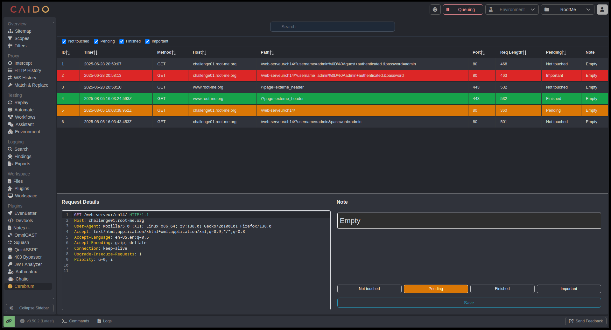
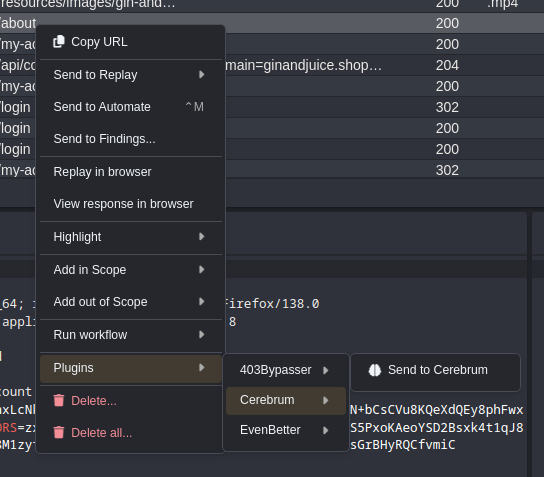

# Cerebrum for Caido

🧠 A simple organizer-like plugin for Caido to help you manage, annotate, and sort HTTP requests.

## ✨ Features

- Save and persist HTTP requests from Caido
- Add custom notes and statuses (`Important`, `Not touched`, `Pending`, `Finished`)
- Filter requests by status, search, and fields
- Inline context menu to delete requests
- Note + status saved locally and in SQLite
- UI built with PrimeVue and TailwindCSS

## 🚀 Screenshots

## 🛠 Usage

- Install plugin
- Use right-click → "Send to Cerebrum" on a request
- View saved requests from the "Cerebrum" sidebar tab

## 📦 Technical Stack

- **Frontend**: Vue 3 + PrimeVue + TailwindCSS
- **Backend**: Caido plugin API + SQLite
- **SDKs**: Caido Frontend/Backend SDKs + GraphQL

## 🧪 Known limitations

- 🔁 Replay integration is currently disabled
- 📥 Requests are read-only once saved (raw cannot be edited)
- 🖍️ No syntax highlighting in the request display
- 📝 No export/import functionality yet

## 📁 Structure

- `backend/` — SQLite logic + API definitions
- `frontend/` — Vue UI, SDK integration, filtering
- `src/components` — `RequestTable.vue`, `RequestDetails.vue`, etc.

## 🎯 Future Goals

- 🔄 Automatically load requests on startup (avoid relying on manual "load" button)
- 📤 Support sending requests back into Replay
- 🌈 Add HTTP request syntax highlighting (via Caido editors or external lib)
- 📝 Support markdown syntax inside notes
- 📦 Add JSON export for individual or full request data

## 🧑‍💻 Author

Built by DewSecOff — Contributions welcome!
